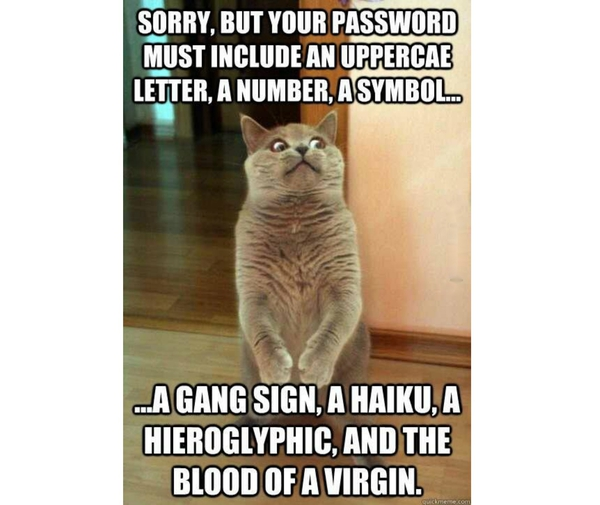
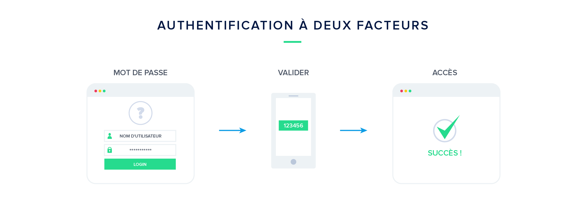
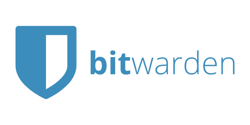

= Password
:notitle:

== Meet JeanJacques

[.notes]
--
Jean Jacques travail dans l'it et a besoin de mot de passe pour vérifier son identité
Seulement voila jean jacques utilise le mot de passe le plus utilisé : 123456
Son équipe Support/Desk à mis en place une politique de mot de passe pour éviter le problème
--

[%notitle]
=== Password Policy

[.notes]
--
Là c'est ce qui se passe dans la tête de Jean jacques.
Il est pas serein JayJay mais il se force et apprend un mot de passe compliqué pour tout ses comptes
--

[%notitle]
=== Unique Password

[.notes]
--
Bon à ce moment c'est un coup dur quand JayJay
Il apprend qu'un mot de passe unique peut mettre en péril la sécurité de ses autres comptes
--

image::password.png[height=400]

[%notitle]
=== Authent à 2 facteurs

[.notes]
--
Le coup fatal pour JJ c'est l'annonce d'une mécanique d'autent à 2 facteurs
--

[%notitle]
== Solutions

[.notes]
--
Je dois vous avouer un truc moi aussi ca me gonfle:
* de devoir changer de mot de passe régulièrement
* de devoir chercher des mots de passes compliqué
* d'avoir un mot de passe par site/application
--

[%notitle]
=== Vault

[.notes]
--
Les coffres d'entreprise, type vault de hashicorp sont de bonnes solutions pour stocker des données sensibles
Individuellement il existe aussi des coffres logiciels
--

image::vault.jpg[]

[%notitle]
=== Bitwarden[https://bitwarden.com]

[.notes]
--
Ceci n'est pas une vidéo sponsorisée simplement un outil que je partage avec vous
--

=== Demo

[.notes]
--
* Télechargement
* Inscription
* Plugin Chrome
--